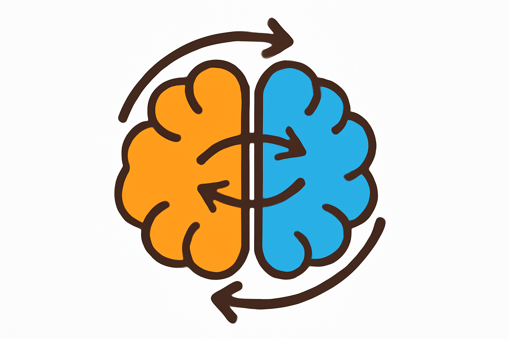

    
#  Cross from Left to Right Brain: Adaptive Text Dreamer for Vision-and-Language Navigation

    
<!--      -->

## Project Overview
We introduce a novel strategy that adaptively imagines key environmental semantics in linguistic form, enabling a more efficient and reliable navigation solution. We have innovatively designed the Adaptive Text Dreamer (ATD), a dual-branch self-guided imagination policy grounded in Large Language Models (LLMs). ATD mimics the human left-right brain architecture, where the "left brain" focuses on logical integration, and the "right brain" is responsible for imaginative prediction of future scenarios. To effectively activate domain-specific knowledge within LLMs, we only fine-tune the Q-former in both branches, facilitating dynamic updates of logical reasoning and imagination during navigation. Additionally, a cross-interaction mechanism is introduced to regularize the imagined outputs and inject them into a navigation expert module, allowing ATD to seamlessly combine the reasoning capabilities of LLMs with the expertise of navigation models.

## Code
Will coming soon~~~
